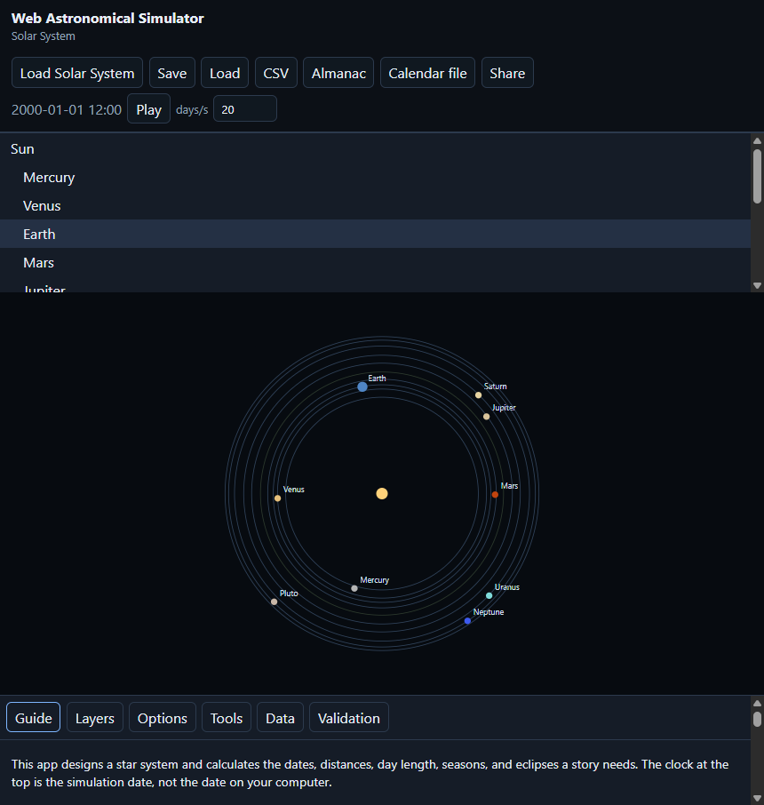
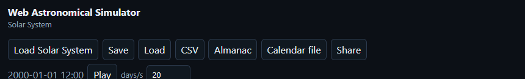
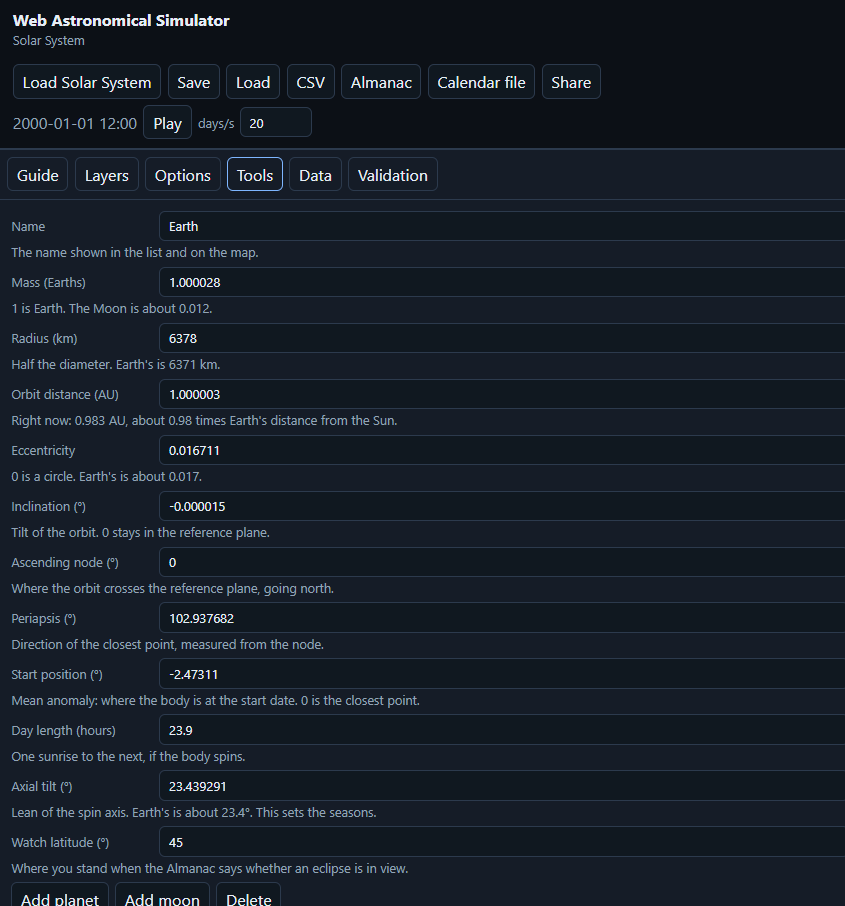
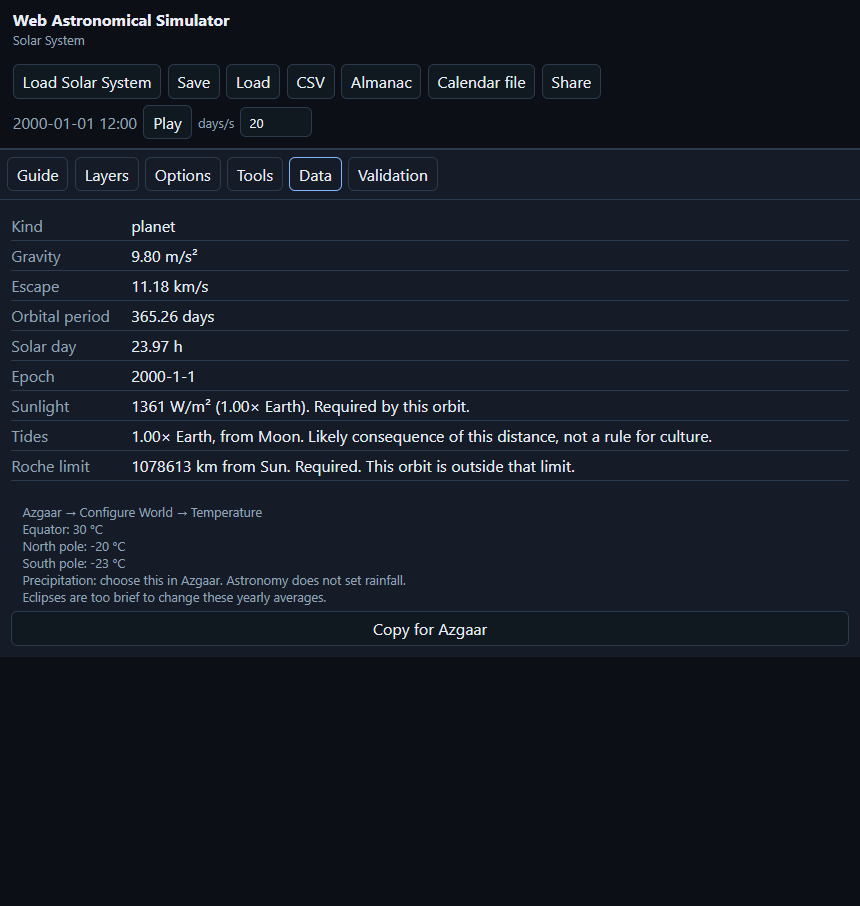

# User guide

This app designs a star system and calculates the dates, distances, day length, seasons, and eclipses a story needs. The clock at the top is the simulation date, not the date on your computer.

The live app is https://jopo12321.github.io/web-astronomical-simulator/

You can also download `web-astronomical-simulator.html` from the [releases](https://github.com/Jopo12321/web-astronomical-simulator/releases) and open that file in a browser. The release page itself does not run the app. If the downloaded page stays blank, use the live site.

## A short session

1. Open the live site. The Solar System is on the map. Earth is the home world.
2. Click a name in the list on the left. The map dot and the side panel follow that body.
3. Open **Tools** and change a number. Orbit distance, mass, angles, day length, and axial tilt are edited there.
4. Open **Data** for the calculated numbers: gravity, sunlight, tides, and, for the home world, the three temperatures Azgaar can use.
5. Press **Almanac** to download a readable handout.

**Play** moves the clock forward. **days/s** is how many simulated days pass each real second. They sit on one row with the date.

## The map and the list

The map draws orbits around the star. Moons are not dots on that map. A moon is indented under its planet in the list. Select it there, then use **Data** or **Tools**.

**Layers** turns orbits, name labels, and belts on or off.

## Buttons

- **Load Solar System** replaces the system on screen with the real Solar System. It asks first if you have something else open. Files you already saved are not deleted.
- **Save** downloads a `.ssim.json` file. **Load**, or dropping that file on the page, opens it again.
- **CSV** downloads a spreadsheet of every body: mass, radius, and distance.
- **Almanac** downloads a readable handout. It builds a calendar for the home world if you have not already, and it lists distances, eclipses, sunlight, tides, and the Azgaar temperatures.
- **Calendar file** downloads an `.ics` file with the epoch date, for a calendar app.
- **Share** copies a link that reopens this system.

## Make a new system

Open **Options**. Pick a layout, then press **New system**. The menu alone does not rebuild the system.

**Custom** starts with only a star. Add planets yourself. The other layouts place worlds for you. **Habitable moon** names one moon Haven and makes it the home world, when the layout has a giant planet. **Tidally lock the home world** sets its day about equal to its year.

## Add a planet or a moon

Pick a body, then open **Tools**.

**Add planet** puts a new world around the star, outside the outermost one. **Add moon** puts a moon around the planet you have selected. Select a planet first. **Delete** removes that body and its moons. The star cannot be deleted.

Orbit angles are in degrees. Inclination is the tilt of the orbit. The node is where the orbit crosses the reference plane. Periapsis is the closest point. Mean anomaly is where the body sits at the start date. Axial tilt is the lean of the spin axis.

Under the orbit distance, Tools also shows how far the body is right now.

## Numbers on Data

**Data** shows gravity, escape speed, the length of the year, and the solar day. For a star it shows the habitable zone in AU.

For a world with an orbit it also shows:

- **Sunlight** in W/m², compared with Earth's 1361. This is required by the distance you set.
- **Tides**, compared with Earth and the Moon. A likely consequence of that distance, not a rule for a culture.
- **Roche limit.** Inside it, the body cannot hold together.
- **Hill sphere.** Inside it, a planet can keep a moon. That is not a promise of stability for millions of years.
- For a moon, how many degrees wide the parent planet looks, compared with the Moon from Earth.

## Azgaar's map

Azgaar does not import a star system. Under Configure World, Temperature, it asks for three yearly temperatures: equator, north pole, and south pole.

On the home world, **Data** prints those three lines. **Copy for Azgaar** copies only those lines. Paste them into Azgaar. Precipitation stays a choice you make there. This app does not calculate rainfall.

Eclipses are too brief to change those yearly averages. If the world is tidally locked, set the north and south poles separately in Azgaar. That is the right way to paint a locked world.

Day length, tides, eclipses, and how big the giant looks are for the story, not for the map generator. The same block is in the Almanac.

## More notes

- [Physics notes](PHYSICS.md) — the formulas, and which numbers are required.
- [Data sources](DATA_SOURCES.md) — NASA, JPL, IAU, and USNO pages the Solar System is checked against.
